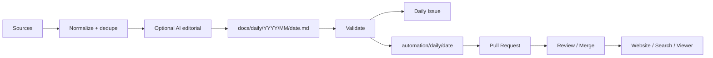

# Gaussian Splatting Daily — Product & Automation Architecture

## 1. Product thesis

`gaussian-splatting-daily` should be a **research signal portal**, not just a folder of notes.

The durable contract is:

> **Git is the source of truth, Markdown is the archive, Issues are the run/correction log, Pull Requests are the publication boundary, and the website is a rebuildable presentation layer.**

This keeps the content readable and auditable even if the frontend framework, hosting provider, search engine, or AI layer changes later.

## 2. Core pipeline



### Source layer

V1 starts with the arXiv API query for `"gaussian splatting"`. The collector is intentionally small and deterministic. More source adapters can be added later for:

- project/research lab feeds;
- GitHub repositories and releases;
- conference project pages;
- demos and datasets;
- manually curated links in an inbox.

Source adapters must normalize into stable IDs before AI processing. The model must never invent canonical IDs, URLs, dates, or repository names.

## 3. Repository contract

```text
gaussian-splatting-daily/
├── .github/
│   ├── workflows/
│   │   ├── daily-ingest.yml
│   │   └── validate-content.yml
│   ├── ISSUE_TEMPLATE/
│   │   └── correction.yml
│   └── pull_request_template.md
├── docs/
│   ├── index.md
│   ├── architecture.md
│   ├── schema.md
│   ├── corrections.md
│   └── daily/
│       ├── _template.md
│       └── YYYY/MM/YYYY-MM-DD.md
├── data/
│   ├── sources.yml
│   └── daily-index.json
├── state/
│   └── checkpoint.json
└── scripts/
    ├── generate_daily.py
    ├── validate_daily.py
    └── build_index.py
```

### Rules

1. One canonical Daily file per `Asia/Tokyo` logical date.
2. Once published, the Daily path does not change.
3. Published factual corrections use a Correction Issue/PR instead of silent rewriting.
4. Generated indexes are derivative and must be rebuildable from `docs/`.
5. Large `.ply`, `.splat`, `.spz`, video and model files do not belong in Git; store URLs/checksums/license metadata instead.
6. Automation branches are deterministic: `automation/daily/YYYY-MM-DD`.
7. A rerun for the same day reuses the same Issue/branch/PR where possible.

## 4. Daily content model

Each Daily has YAML frontmatter plus human-readable Markdown.

Stable metadata:

```yaml
schema_version: 1
id: "gsd-2026-09-29"
date: "2026-09-29"
timezone: "Asia/Tokyo"
generated_at: "2026-09-29T08:17:00+09:00"
status: "draft"
title: "Gaussian Splatting Daily — 2026-09-29"
source_count: 8
ai_enrichment: true
ai_model: "gpt-5.6-luna"
```

Each paper block also carries a machine-readable marker:

```html
<!-- arxiv:2609.12345 -->
```

That marker is used for cross-day deduplication.

## 5. Daily automation

The scheduled workflow runs at **08:17 Asia/Tokyo** and can also be invoked manually.

Normal success path:

```text
schedule / manual dispatch
  -> sync latest main
  -> reuse/create automation/daily/YYYY-MM-DD
  -> query arXiv
  -> exclude IDs already archived on other days
  -> optional OpenAI enrichment
  -> write Daily Markdown
  -> rebuild data/daily-index.json
  -> validate
  -> commit + push branch
  -> reuse/create [Daily] YYYY-MM-DD Issue
  -> reuse/create PR
```

### Why validate before opening the PR

Automated PRs created with the repository `GITHUB_TOKEN` can require approval before a `pull_request` workflow runs. Therefore the ingest workflow performs the publication-critical validation **before** creating/updating the PR. A second read-only PR validator remains useful as defense in depth.

## 6. AI boundary

AI is an editorial layer, not the source of truth.

### Program-owned facts

- arXiv ID;
- canonical URL;
- title;
- author list;
- categories;
- published/updated timestamps;
- Daily logical date;
- GitHub branch/Issue/PR identity.

### Model-owned output

- concise Chinese overview;
- per-item summary;
- topic grouping;
- editorial explanation of why an item matters.

The V1 generator sends only the fetched candidate metadata/abstracts to the model and asks for JSON. If the AI request fails, the run falls back to deterministic metadata instead of blocking the archive.

## 7. Website direction

The intended experience borrows the **information architecture** of research/news portals such as Radiance Fields without cloning its implementation or visual identity.

Recommended routes:

```text
/
├── /daily
├── /daily/YYYY/MM/DD
├── /papers
├── /tools
├── /demos
├── /topics/3dgs
├── /topics/4dgs
├── /topics/rendering
├── /search
└── /ask
```

### Homepage

The homepage should feel like a professional research signal dashboard:

- **Today** — current Daily lead stories;
- **Featured** — high-signal papers/tools/demos;
- **Latest papers** — compact research cards;
- **Tools & viewers** — practical ecosystem updates;
- **Demos** — visual/interactive items;
- **Topic chips** — 3DGS, 4DGS, compression, SLAM, dynamic scenes, relighting, avatars, rendering;
- global search.

### Detail page

```text
Title
One-line editorial summary
Paper / Repo / Demo / 3D badges
Source metadata
Editorial body
Optional interactive Gaussian Splat viewer
Technical metadata / license / asset format
Related items
Ask about this item
Correction + GitHub provenance
```

The 3D canvas is progressive enhancement. Titles, authors, summaries, sources and controls must remain semantic HTML for SEO and accessibility.

## 8. Frontend architecture

Long-term target:

```text
GitHub docs/
   -> build-time content parser
   -> search/index data
   -> Next.js
       -> static article/topic pages
       -> search
       -> OpenGraph/SEO
       -> optional PlayCanvas/Three.js GS viewer
       -> optional server-side /api/ask
```

Start static-first. Dynamic server features should be added only when they provide clear value.

### 3D assets

Large Gaussian Splat assets should live in object storage/CDN. Git stores:

- public asset URL;
- poster image;
- format (`spz`, `ply`, `splat`);
- byte size;
- checksum;
- license;
- source attribution.

On mobile, show the poster first and load the 3D asset only after user interaction.

## 9. Governance

Recommended `main` rules:

- PR required;
- no force-push;
- required content validation;
- CODEOWNER review for workflows/schema/security-sensitive scripts;
- squash merge for Daily PRs.

V1 can use human merge. Mature automation can switch to a dedicated GitHub App and auto-merge only after required checks.

## 10. Rollout

### Phase 1 — repository baseline

- docs contract;
- source config;
- generator;
- validator;
- Daily Issue/PR automation.

### Phase 2 — editorial quality

- add `OPENAI_API_KEY`;
- tune summary prompts;
- add source adapters;
- add correction workflow.

### Phase 3 — site

- choose visual direction;
- build Next.js static frontend from `docs/`;
- add topic/paper/tool indexes and search.

### Phase 4 — rich research portal

- Gaussian Splat viewer;
- object storage/CDN;
- Ask/search assistant;
- richer demos and project metadata.

## 11. Operational constraints

- arXiv legacy API usage should remain polite and serialized; this project makes one small query per Daily run.
- Scheduled workflows only become effective after the workflow exists on the default branch.
- A newly created GitHub repository may require enabling Actions to create pull requests, or supplying a bot token.
- Public repositories can have inactive scheduled workflows disabled after prolonged repository inactivity.
- The Daily archive should remain useful even when AI, the website, or a source API is temporarily unavailable.

## References

- GitHub Actions workflow syntax: https://docs.github.com/en/actions/reference/workflows-and-actions/workflow-syntax
- GitHub GITHUB_TOKEN behavior: https://docs.github.com/en/actions/concepts/security/github_token
- GitHub CLI PR creation: https://cli.github.com/manual/gh_pr_create
- arXiv API manual: https://info.arxiv.org/help/api/user-manual.html
- arXiv API terms: https://info.arxiv.org/help/api/tou.html
- Radiance Fields: https://radiancefields.com/
- Next.js static export: https://nextjs.org/docs/app/guides/static-exports
- PlayCanvas Gaussian Splatting: https://developer.playcanvas.com/user-manual/gaussian-splatting/
- OpenAI Responses API: https://developers.openai.com/api/docs/guides/text


## 12. Image discovery

Daily entries may render source-owned research figures.

V1 image policy:

1. fetch the paper's arXiv HTML page only for selected Daily items;
2. discover the first usable image inside the first figure;
3. keep the image remote rather than copying paper assets into Git;
4. store/render the figure caption as alt text when available;
5. place source attribution directly below the image;
6. treat image discovery as best-effort: failure must not fail the Daily.

The site must use a text/poster fallback when a remote figure is unavailable. Future adapters can prefer an official project-page OpenGraph/hero image before falling back to the arXiv figure.

## 13. Automatic merge policy

A Daily PR is still created for provenance, discussion, and rollback, but the scheduled workflow may squash-merge it automatically after the publication-critical validator succeeds inside the same workflow.

This deliberately keeps the Issue/PR audit trail while removing a daily manual merge requirement. Workflow/schema/security changes remain normal human-reviewed repository changes and are not produced by the Daily generator.
